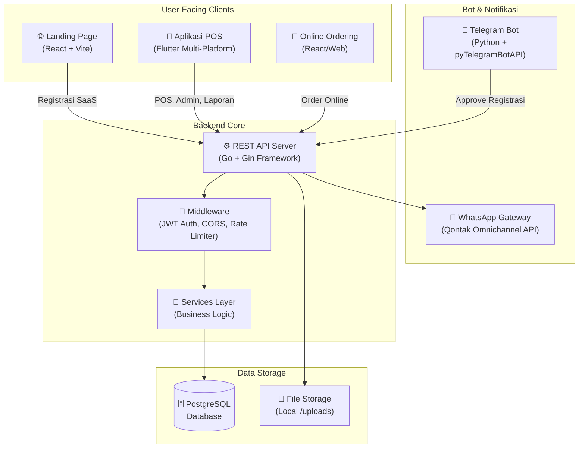

# 🛠️ Technology Stack — NFM POS

Dokumen ini menjelaskan secara detail seluruh tumpukan teknologi yang digunakan dalam platform **NFM POS SaaS**.

---

## 1. Gambaran Arsitektur Sistem



---

## 2. Backend (API Server)

| Komponen | Teknologi | Versi | Keterangan |
|----------|-----------|-------|------------|
| Bahasa | **Go (Golang)** | 1.20+ | Performa tinggi, statically typed |
| HTTP Framework | **Gin Web Framework** | v1.9+ | Routing cepat, middleware support |
| ORM | **GORM** | v2 | Object-Relational Mapping untuk PostgreSQL |
| Database Driver | `gorm.io/driver/postgres` | v1 | Koneksi native ke PostgreSQL |
| Authentication | **JWT (JSON Web Tokens)** | `golang-jwt/jwt v4` | Stateless session auth |
| Password Hashing | **bcrypt** | `golang.org/x/crypto` | One-way secure hashing |
| Config Management | **godotenv** | v1 | Load `.env` file ke environment |
| Rate Limiting | Custom Middleware | - | IP-based rate limit (5 req/10 menit untuk registrasi) |
| Image Processing | Standard Library | - | Multipart file upload ke `/uploads` |

### Struktur Direktori Backend

```
backend/
├── cmd/api/
│   └── main.go              # Entry point, routing definitions
├── internal/
│   ├── handlers/            # HTTP handlers (controllers)
│   │   ├── auth.go          # Login, JWT
│   │   ├── order.go         # Transaksi & stock deduction
│   │   ├── dashboard.go     # Statistik & laporan
│   │   ├── registration.go  # SaaS signup flow
│   │   └── ...              # 25+ handler files
│   ├── middleware/
│   │   ├── auth.go          # JWT Auth Middleware
│   │   ├── cors.go          # CORS Headers
│   │   └── rate_limiter.go  # Rate Limiter
│   ├── models/
│   │   └── models.go        # Semua struct GORM (25+ tabel)
│   └── services/
│       └── whatsapp.go      # WhatsApp notification service
├── database/
│   └── db.go                # PostgreSQL connection & AutoMigrate
└── uploads/                 # Direktori file upload (images)
```

---

## 3. Frontend (Aplikasi POS & Admin)

| Komponen | Teknologi | Versi | Keterangan |
|----------|-----------|-------|------------|
| Bahasa | **Dart** | 3.0+ | Typed, compiled language |
| Framework | **Flutter** | 3.x | Multi-platform (Web, Windows, Android, iOS) |
| State Management | **Flutter Riverpod** | v2 | Reactive, testable state management |
| HTTP Client | **Dio** | v5 | Advanced HTTP client dengan interceptors |
| Routing | **Go Router** | v10 | Declarative routing dengan guard |
| Charting | **FL Chart** | v0.6 | Grafik laporan penjualan interaktif |
| PDF | `pdf` + `printing` | - | Cetak laporan dan struk ke PDF |
| Storage | `shared_preferences` | - | Penyimpanan lokal token JWT |
| File Picker | `image_picker` | - | Upload gambar menu & meja |

### Struktur Direktori Frontend

```
frontend/lib/
├── core/
│   ├── api/
│   │   └── api_client.dart      # Dio client dengan JWT interceptor
│   ├── providers/
│   │   └── auth_provider.dart   # Global auth state
│   └── theme/
│       └── app_theme.dart       # Design system & color tokens
├── features/
│   ├── auth/                    # Login screen
│   ├── dashboard/               # Dashboard & executive stats
│   ├── orders/                  # POS transaksi
│   ├── menu/                    # Manajemen produk
│   ├── table/                   # Manajemen meja
│   ├── inventory/               # Stok bahan baku
│   ├── finance/                 # Chart of Accounts, jurnal
│   ├── reports/                 # Laporan keuangan
│   ├── registration/            # Manajemen pendaftaran SaaS
│   └── settings/                # Pengaturan sistem
└── main.dart                    # Entry point & router config
```

---

## 4. Landing Page (Pemasaran & Registrasi)

| Komponen | Teknologi | Versi | Keterangan |
|----------|-----------|-------|------------|
| Framework | **React.js** | 18+ | Component-based UI |
| Build Tool | **Vite** | 5+ | Ultra-fast dev server & bundler |
| Bahasa | **JavaScript ES6+** | - | Modern JS dengan async/await |
| Animasi | **Framer Motion** | v10 | Micro-interaction dan animasi premium |
| Styling | **Vanilla CSS** | - | Custom properties, CSS variables |
| HTTP | `fetch` API | - | Native browser fetch untuk form submit |

---

## 5. Bot Asisten (Telegram)

| Komponen | Teknologi | Keterangan |
|----------|-----------|------------|
| Bahasa | **Python** | 3.9+ |
| Bot Framework | **pyTelegramBotAPI** | Polling & Callback handler |
| Web Framework | **Flask** | Proxy webhook & health endpoint |
| HTTP Client | **requests** | Panggil backend API |
| Fungsi Utama | Approval registrasi via Telegram | Supervisor bisa approve/reject langsung dari Telegram |

---

## 6. Database

| Komponen | Teknologi | Keterangan |
|----------|-----------|------------|
| RDBMS | **PostgreSQL** | 14+ — Reliable, ACID-compliant |
| Migrasi | **GORM AutoMigrate** | Schema sync otomatis saat startup |
| Backup | pg_dump | Manual backup via `pos_resto_backup.sql` |

---

## 7. DevOps & Deployment

| Komponen | Teknologi | Keterangan |
|----------|-----------|------------|
| Containerization | **Docker** + **Docker Compose** | `docker-compose.yml` di root |
| Proxy | **Nginx** (opsional) | Reverse proxy untuk production |
| Config | `.env` file | Variabel environment untuk semua service |
| Deployment Script | `deploy.sh` | Bash script untuk deploy otomatis |
| Update IP | `update_ip.ps1` | PowerShell script update IP di config |

### Environment Variables (`.env`)

```env
# Database
DB_HOST=localhost
DB_PORT=5432
DB_USER=postgres
DB_PASSWORD=your_password
DB_NAME=pos_resto

# JWT
JWT_SECRET=your_jwt_secret_key

# Server
PORT=8080

# WhatsApp (Qontak)
WHATSAPP_API_KEY=your_qontak_api_key
WHATSAPP_CHANNEL_ID=your_channel_id

# Telegram Bot
TELEGRAM_BOT_TOKEN=your_bot_token
TELEGRAM_ADMIN_CHAT_ID=your_chat_id

# Frontend API URL
VITE_API_URL=http://localhost:8080/api
```

---

## 8. Integrasi Eksternal

| Layanan | Provider | Kegunaan |
|---------|----------|----------|
| WhatsApp Messaging | **Qontak Omnichannel** | Notifikasi aktivasi akun, struk |
| AI Chatbot | **Gemini AI** (via proxy) | Asisten chatbot menu berbasis AI |
| Pembayaran | **QRIS** (static QR) | Payment gateway untuk subscription |

---

*Terakhir diperbarui: Juni 2026 | Tim NFM Tech*
