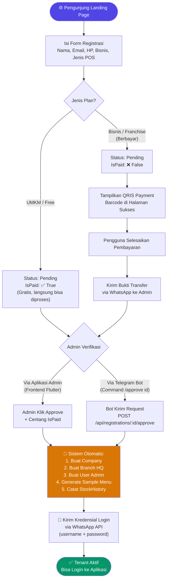
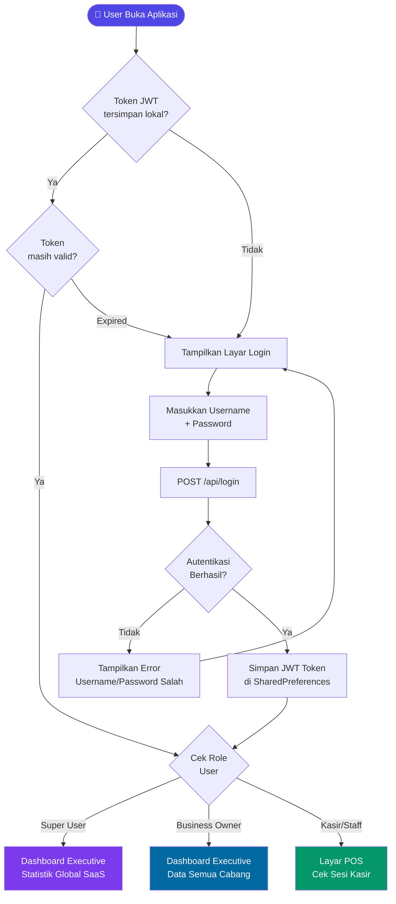
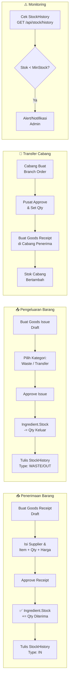
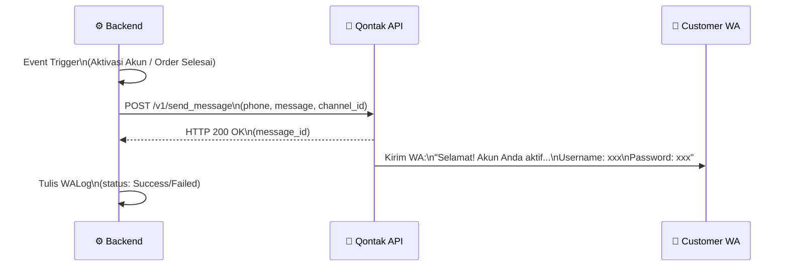

# 🔄 Diagram Alur Sistem — NFM POS

Dokumen ini berisi diagram alur (flow diagram) untuk seluruh proses bisnis utama dalam platform NFM POS.

---

## 1. Alur Registrasi & Aktivasi SaaS (End-to-End)



---

## 2. Alur Login & Akses Sistem



---

## 3. Alur Transaksi POS (Lengkap)

```mermaid
flowchart TD
    Start([👨‍💼 Kasir Buka Aplikasi]) --> CheckSession{Sesi Kasir\nAktif?}

    CheckSession -->|Tidak| OpenSession[Buka Sesi Kasir\nInput Kas Awal]
    CheckSession -->|Ya| PosScreen[Layar POS]
    OpenSession --> PosScreen

    PosScreen --> POSType{Tipe POS\nBisnis?}
    
    POSType -->|Resto| TableSelect[Pilih Meja\n(Status: Kosong)]
    POSType -->|Retail/Fashion/Jasa| DirectOrder[Langsung Pilih Produk]
    
    TableSelect --> SelectMenu[Pilih Menu/Produk\n+ Qty]
    DirectOrder --> SelectMenu
    
    SelectMenu --> AddNotes[Tambah Catatan\n(Opsional)]
    AddNotes --> ApplyPromo[Terapkan Promo\n(Opsional)]
    ApplyPromo --> CreateOrder[POST /api/orders\nBuat Pesanan]

    CreateOrder --> StockCheck{Cek Stok\nOtomatis}
    StockCheck -->|Stok Cukup| OrderCreated[✅ Order Dibuat\nStatus: Pending]
    StockCheck -->|Stok Habis| StockError[❌ Error:\nStok Bahan Tidak Cukup]
    StockError --> SelectMenu

    OrderCreated --> POSTypeStock{Tipe POS?}
    POSTypeStock -->|Retail/Fashion| DeductMenuStock[Potong Menu.Stock\nLangsung]
    POSTypeStock -->|Resto/Jasa| CheckRecipe{Ada Resep\nIngredient?}
    CheckRecipe -->|Ya| DeductIngredient[Potong Ingredient.Stock\n+ Tulis StockHistory]
    CheckRecipe -->|Tidak| NoStockDeduct[Jual Tanpa\nPotong Stok]
    
    DeductMenuStock --> WaitPayment
    DeductIngredient --> WaitPayment
    NoStockDeduct --> WaitPayment

    WaitPayment[⏳ Menunggu Pembayaran] --> ProcessPay[POST /api/orders/:id/pay\nInput Nominal Bayar]
    ProcessPay --> PayMethod{Metode\nPembayaran}
    PayMethod -->|Tunai| CalcChange[Hitung Kembalian]
    PayMethod -->|QRIS/Transfer| RefNo[Input No. Referensi]
    
    CalcChange --> FinalizeOrder
    RefNo --> FinalizeOrder
    FinalizeOrder[✅ Order Selesai\nIsPaid: True\nStatus: Selesai] --> SendReceipt[Kirim Struk\nvia WhatsApp]
    SendReceipt --> TableFree[Update Meja\nStatus: Kosong]
    TableFree --> PosScreen

    style Start fill:#4F46E5,color:#fff
    style FinalizeOrder fill:#059669,color:#fff
    style StockError fill:#DC2626,color:#fff
```

---

## 4. Alur Manajemen Stok (Inventory)



---

## 5. Alur Void / Pembatalan Transaksi

```mermaid
flowchart TD
    A[👤 Kasir Pilih Order\nyang Ingin Dibatalkan] --> B{Order Sudah\nDibayar?}
    
    B -->|Belum Bayar| C[POST /api/orders/:id/void\nInput Alasan Void]
    B -->|Sudah Bayar| D[❌ Tidak Bisa Void\nHarus Manual Refund]

    C --> E{Tipe POS?}
    E -->|Retail/Fashion| F[Kembalikan Menu.Stock\n+= Qty Item]
    E -->|Resto/Jasa| G{Ada Resep\nIngredient?}
    G -->|Ya| H[Kembalikan Ingredient.Stock\n+ StockHistory Type: VOID]
    G -->|Tidak| I[Tidak Ada Stock\nyang Dikembalikan]
    
    F --> J[Status Order: Batal]
    H --> J
    I --> J
    J --> K[Meja Dibebaskan\n(Jika Resto)]
    
    style D fill:#DC2626,color:#fff
    style J fill:#6B7280,color:#fff
```

---

## 6. Alur Notifikasi WhatsApp (Qontak)



---

*Terakhir diperbarui: Juni 2026 | Tim NFM Tech*
