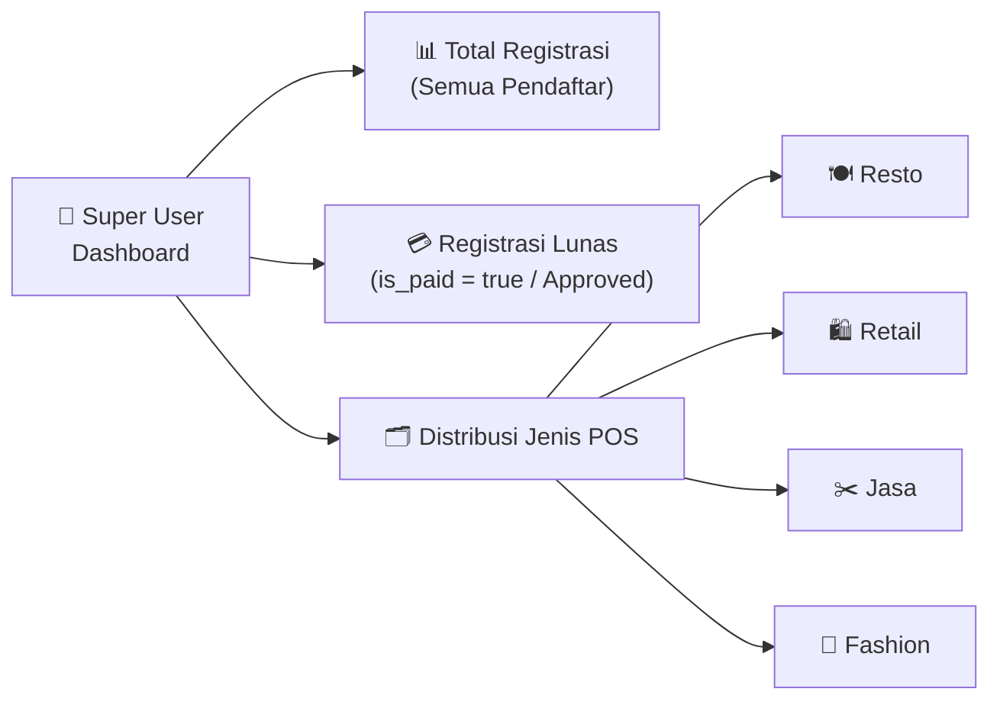
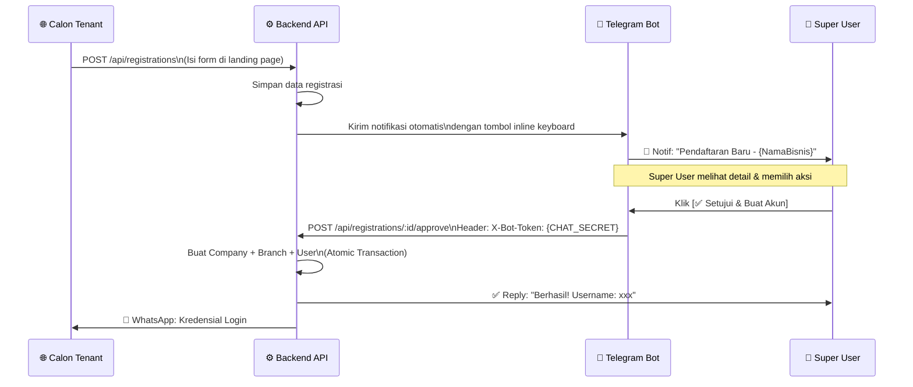

# 👑 Panduan Lengkap Super User — NFM POS SaaS

> **Role**: `Super User` — Pemilik & Operator Platform SaaS NFM Tech  
> **Akses**: Global (lintas tenant, semua data registrasi, statistik platform)

---

## 📋 Daftar Isi

1. [Apa itu Super User?](#1-apa-itu-super-user)
2. [Cara Login](#2-cara-login)
3. [Dashboard Executive Super User](#3-dashboard-executive-super-user)
4. [Alur Lengkap: Pendaftaran → Pembayaran → Aktivasi Tenant](#4-alur-lengkap-pendaftaran--pembayaran--aktivasi-tenant)
5. [Manajemen Registrasi](#5-manajemen-registrasi)
6. [Aktivasi via Telegram Bot](#6-aktivasi-via-telegram-bot)
7. [Manajemen Perusahaan (Tenant)](#7-manajemen-perusahaan-tenant)
8. [Endpoint API Khusus Super User](#8-endpoint-api-khusus-super-user)
9. [Troubleshooting & FAQ](#9-troubleshooting--faq)

---

## 1. Apa itu Super User?

**Super User** adalah role tertinggi dalam platform NFM POS. Super User adalah operator SaaS yang mengelola seluruh ekosistem platform — mulai dari memantau pendaftaran bisnis baru, memverifikasi pembayaran, mengaktifkan akun tenant, hingga memantau distribusi jenis POS yang digunakan.

### Perbedaan Role:

| Kemampuan | Super User | Business Owner | Kasir |
|---|:---:|:---:|:---:|
| Lihat statistik global SaaS | ✅ | ❌ | ❌ |
| Approve/Reject pendaftaran tenant | ✅ | ❌ | ❌ |
| Update status pembayaran pendaftar | ✅ | ❌ | ❌ |
| Update jenis POS pendaftar | ✅ | ❌ | ❌ |
| Hapus data pendaftaran | ✅ | ❌ | ❌ |
| Kelola semua Company/Tenant | ✅ | ❌ | ❌ |
| Lihat data cabang (milik sendiri) | ✅ | ✅ | ❌ |
| Transaksi POS | ❌ | ❌ | ✅ |

---

## 2. Cara Login

1. Buka aplikasi frontend NFM POS di browser atau desktop.
2. Masukkan **username** dan **password** Super User.
3. Sistem akan mendeteksi role `Super User` secara otomatis dan mengarahkan ke **Dashboard Executive Super User**.

```
URL Aplikasi : http://localhost:8085 (dev) / https://product.nfmtech.my.id (prod)
Endpoint Auth: POST /api/login
```

**Payload Login:**
```json
{
  "username": "superuser",
  "password": "your_password"
}
```

**Response Sukses:**
```json
{
  "token": "eyJhbGciOiJIUzI1NiIs...",
  "user": {
    "id": 1,
    "full_name": "Admin NFM",
    "role": { "name": "Super User" }
  }
}
```

> 💡 Token JWT disimpan otomatis di `SharedPreferences` dan digunakan untuk semua request berikutnya via `Authorization: Bearer <token>`.

---

## 3. Dashboard Executive Super User

Setelah login, Super User melihat **Dashboard Executive** yang berisi dua bagian utama:

### A. Statistik Bisnis Tenant (sebagai operator)

| Metrik | Keterangan |
|---|---|
| Total Pendapatan | Akumulasi revenue semua transaksi `Selesai` |
| Total Transaksi | Jumlah order dari semua cabang |
| Jumlah Cabang | Total branch yang aktif |
| Jumlah Staff | Total user staff terdaftar |
| Performa Cabang | Tabel ranking cabang berdasarkan revenue |
| Grafik Harian | Tren pendapatan 7 hari terakhir |
| Grafik Bulanan | Tren pendapatan 12 bulan terakhir |

### B. Statistik SaaS Platform (Eksklusif Super User)



**Data yang ditampilkan dari API `GET /api/dashboard/executive`:**

```json
{
  "is_superuser": true,
  "total_registrations": 42,
  "total_paid_registrations": 30,
  "pos_type_counts": {
    "resto": 18,
    "retail": 10,
    "jasa": 8,
    "fashion": 6
  }
}
```

---

## 4. Alur Lengkap: Pendaftaran → Pembayaran → Aktivasi Tenant

```mermaid
flowchart TD
    subgraph "🌐 FASE 1: PENDAFTARAN (Landing Page)"
        A([Calon Tenant Buka\nlanding-page]) --> B["Isi Form:\n- Nama Lengkap\n- Email\n- No. WhatsApp\n- Nama Bisnis\n- Alamat Bisnis\n- Kategori Bisnis\n- Jenis POS (resto/retail/jasa/fashion)\n- Plan (UMKM/Bisnis/Franchise)\n- Captcha"]
        B --> C{Validasi\nCaptcha}
        C -->|Gagal| B
        C -->|Lolos| D{Cek Plan}
    end

    subgraph "💳 FASE 2: STATUS PEMBAYARAN"
        D -->|"Plan: UMKM\n(Gratis)"| E["Status: Pending\nIsPaid: ✅ TRUE\n(Otomatis)"]
        D -->|"Plan: Bisnis /\nFranchise"| F["Status: Pending\nIsPaid: ❌ FALSE"]
        F --> G["Tampilkan QRIS\nBarcode Pembayaran"]
        G --> H["Calon Tenant\nBayar via Transfer/QRIS"]
        H --> I["Kirim Bukti Bayar\nke WhatsApp Admin"]
    end

    subgraph "🔔 FASE 3: NOTIFIKASI KE SUPER USER"
        E --> J["📱 Bot Telegram\nKirim Notifikasi Otomatis"]
        I --> K["Super User Verifikasi\nBukti Pembayaran Manual"]
        K --> L["Update IsPaid → TRUE\nvia Aplikasi Admin"]
        J --> M{Siap\nApprove?}
        L --> M
    end

    subgraph "✅ FASE 4: AKTIVASI TENANT"
        M -->|"Via Aplikasi Flutter\n(Admin)"| N["Klik Tombol Approve\ndi Menu Registrasi"]
        M -->|"Via Telegram Bot\n(Tombol Inline)"| O["Klik ✅ Setujui\ndi Chat Telegram"]
        
        N --> P
        O --> P

        P["🔧 Sistem Otomatis (Atomic Transaction):\n1️⃣ Buat Company (nama, kode, plan, pos_type)\n2️⃣ Buat Branch HQ (Pusat)\n3️⃣ Buat User Admin (username dari email)\n4️⃣ Generate Password Default: nfm12345\n5️⃣ Update Status Registrasi → Approved\n6️⃣ IsPaid → TRUE"] --> Q
        
        Q["📲 Notifikasi WhatsApp\nke No. HP Tenant:\n'Akun Anda Aktif!\nUsername: xxx\nPassword: nfm12345\nURL: product.nfmtech.my.id'"]
        
        Q --> R["📦 Seed Data Sample\n(Background Process):\n- 1 Kategori Produk\n- 1 Contoh Produk\n  sesuai jenis POS"]
        
        R --> S([✅ TENANT AKTIF\nBisa Login ke Aplikasi])
    end

    style A fill:#4F46E5,color:#fff
    style S fill:#059669,color:#fff
    style P fill:#D97706,color:#fff
    style Q fill:#0369A1,color:#fff
```



### Detail Logika Otomatis Saat Approve:

| Langkah | Aksi Sistem | Detail |
|---------|-------------|--------|
| **1** | Buat `Company` | Kode otomatis dari nama bisnis + ID registrasi |
| **2** | Buat `Branch` | Nama: "Pusat (HQ)", Kode: `{companyCode}-01` |
| **3** | Buat `User Admin` | Username dari prefix email, Role: Admin |
| **4** | Set Password | Default: `nfm12345` (hashed dengan bcrypt) |
| **5** | Update Registrasi | Status → `Approved`, IsPaid → `true` |
| **6** | Kirim WA | Notifikasi kredensial ke nomor HP tenant |
| **7** | Seed Data | Category + 1 produk contoh sesuai jenis POS |

---

## 5. Manajemen Registrasi

### 5.1 Melihat Daftar Registrasi

Akses menu **"Manajemen Registrasi"** di sidebar aplikasi.

```
GET /api/registrations
Header: Authorization: Bearer <token>
```

Setiap baris menampilkan:
- Nama lengkap & nama bisnis
- Email & No. WhatsApp
- **Jenis POS** (resto / retail / jasa / fashion) — dengan badge warna
- **Plan** (UMKM / Bisnis / Franchise)
- **Status Bayar** (Lunas ✅ / Belum ❌)
- **Status** (Pending / Approved / Rejected)
- Tanggal daftar

### 5.2 Update Status Pembayaran

Saat tenant sudah bayar dan kirim bukti, Super User mencentang `IsPaid`:

```
PUT /api/registrations/:id
Body: { "is_paid": true }
```

### 5.3 Update Jenis POS

Jika pendaftar salah pilih jenis POS, Super User bisa mengubahnya sebelum approval:

```
PUT /api/registrations/:id
Body: { "pos_type": "retail" }
```

Nilai valid: `resto` | `retail` | `jasa` | `fashion`

### 5.4 Update Status Manual

```
PUT /api/registrations/:id
Body: { "status": "Rejected" }
```

Nilai valid: `Pending` | `Approved` | `Rejected`

### 5.5 Approve Registrasi (Aktivasi Tenant)

```
POST /api/registrations/:id/approve
Header: Authorization: Bearer <token>
```

> ⚠️ **Syarat approve**: Pastikan `is_paid = true` sebelum approve. Approval bisa dilakukan walaupun belum bayar (sistem tidak memblokir), tapi tidak direkomendasikan.

### 5.6 Hapus Registrasi

Untuk data registrasi yang invalid/spam:

```
DELETE /api/registrations/:id
Header: Authorization: Bearer <token>
```

---

## 6. Aktivasi via Telegram Bot

Super User dapat menyetujui atau menolak pendaftaran langsung dari **chat Telegram** tanpa membuka aplikasi.

### 6.1 Cara Kerja



### 6.2 Format Pesan Telegram

```
🚀 Pendaftaran Baru (UMKM)
━━━━━━━━━━━━━━━━━━━━
👤 Nama: Budi Santoso
🏢 Bisnis: Warung Makan Bu Budi
📁 Kategori: F&B (Resto/Cafe)
🖥️ Jenis POS: resto
💳 Status Bayar: 🟢 Sudah Bayar (Free/Lunas)
📍 Alamat: Jl. Merdeka No.1, Bandung
📧 Email: budi@gmail.com
📞 WhatsApp: `08123456789`
━━━━━━━━━━━━━━━━━━━━

💡 Gunakan tombol di bawah untuk menyetujui dan membuat akun otomatis.

[✅ Setujui & Buat Akun]  [❌ Tolak]
```

### 6.3 Konfigurasi Environment

```env
TELEGRAM_BOT_TOKEN=your_bot_token_from_botfather
TELEGRAM_CHAT_ID=your_admin_chat_id_or_group_id
CHAT_SECRET=your_secret_key_for_bot_api_calls
```

---

## 7. Manajemen Perusahaan (Tenant)

Super User memiliki akses ke modul **Company Management** untuk mengelola semua tenant yang sudah aktif.

### 7.1 Melihat Semua Tenant

```
GET /api/companies
Header: Authorization: Bearer <token>
```

### 7.2 Upload Logo Tenant

```
POST /api/companies/upload
Body: multipart/form-data (file)
```

### 7.3 Update Data Tenant

```
PUT /api/companies/:id
Body: {
  "name": "Nama Baru",
  "subscription_plan": "Pro",
  "pos_type": "retail",
  "is_active": true
}
```

> ⚠️ Field `pos_type` di Company adalah flag utama yang menentukan fitur POS yang aktif (meja, resep, stok langsung, dll).

### 7.4 Nonaktifkan Tenant

```
PUT /api/companies/:id
Body: { "is_active": false }
```

---

## 8. Endpoint API Khusus Super User

### Registrasi & SaaS Management

| Method | Endpoint | Auth | Keterangan |
|--------|----------|------|------------|
| `GET` | `/api/registrations` | ✅ JWT | List semua pendaftaran (urut terbaru) |
| `PUT` | `/api/registrations/:id` | ✅ JWT | Update status, is_paid, pos_type |
| `POST` | `/api/registrations/:id/approve` | ✅ JWT atau X-Bot-Token | Approve & aktivasi tenant otomatis |
| `DELETE` | `/api/registrations/:id` | ✅ JWT | Hapus data registrasi |

### Dashboard & Statistik

| Method | Endpoint | Auth | Keterangan |
|--------|----------|------|------------|
| `GET` | `/api/dashboard/executive` | ✅ JWT | Statistik executive + data SaaS (khusus Super User) |

**Response tambahan jika Super User:**
```json
{
  "is_superuser": true,
  "total_registrations": 42,
  "total_paid_registrations": 30,
  "pos_type_counts": {
    "resto": 18,
    "retail": 10,
    "jasa": 8,
    "fashion": 6
  }
}
```

### Company Management

| Method | Endpoint | Auth | Keterangan |
|--------|----------|------|------------|
| `GET` | `/api/companies` | ✅ JWT | List semua company/tenant |
| `GET` | `/api/companies/:id` | ✅ JWT | Detail 1 company |
| `POST` | `/api/companies` | ✅ JWT | Buat company manual |
| `PUT` | `/api/companies/:id` | ✅ JWT | Update data company |
| `DELETE` | `/api/companies/:id` | ✅ JWT | Hapus company |
| `POST` | `/api/companies/upload` | ✅ JWT | Upload logo company |

### Public (Tanpa Auth — Digunakan Landing Page)

| Method | Endpoint | Auth | Keterangan |
|--------|----------|------|------------|
| `POST` | `/api/registrations` | ❌ (Rate Limited) | Form registrasi dari landing page |
| `GET` | `/api/captcha` | ❌ | Generate captcha security image |

---

## 9. Troubleshooting & FAQ

### ❓ Approve berhasil tapi tenant tidak bisa login?

**Penyebab**: Username yang dibuat sudah ada di database sebelumnya.

**Solusi**: Sistem menambahkan angka ID di belakang username jika duplikat. Cek response API saat approve — username dan password dikirimkan di response body dan via WhatsApp.

```json
{
  "message": "Pendaftaran berhasil disetujui",
  "username": "budi123",
  "password": "nfm12345",
  "url": "https://product.nfmtech.my.id"
}
```

---

### ❓ Notifikasi Telegram tidak masuk?

**Cek**: Pastikan environment variable `TELEGRAM_BOT_TOKEN` dan `TELEGRAM_CHAT_ID` sudah terisi di `.env`.

```bash
# Cek apakah bot token valid
curl https://api.telegram.org/bot{YOUR_TOKEN}/getMe
```

---

### ❓ Bisa approve tanpa IsPaid = true?

**Ya, bisa** — sistem tidak memblokir. Tapi best practice-nya:
1. Pastikan bukti bayar sudah diterima.
2. Update `is_paid = true` via `PUT /api/registrations/:id`.
3. Baru klik **Approve**.

Jika plan UMKM, `is_paid` sudah otomatis `true` saat registrasi.

---

### ❓ Jenis POS apa yang bisa dipilih?

| Nilai | Nama | Fitur Utama |
|-------|------|-------------|
| `resto` | Restoran / Kafe | Manajemen meja, resep bahan, KDS |
| `retail` | Toko Retail | Stok langsung per produk, tanpa meja |
| `jasa` | Layanan Jasa | Resep opsional (bisa tanpa stok) |
| `fashion` | Toko Fashion | Stok langsung per produk (mirip retail) |

---

### ❓ Apa yang terjadi jika approve gagal di tengah jalan?

Sistem menggunakan **database transaction atomik**. Jika salah satu langkah gagal (misal gagal buat user), seluruh operasi di-rollback — tidak ada data Company/Branch yang tertinggal.

```
tx.Begin() → Create Company → Create Branch → Create User → tx.Commit()
                                                              ↑ Jika gagal di sini → tx.Rollback()
```

---

*Terakhir diperbarui: Juni 2026 | Tim NFM Tech*  
*File: `doc/SUPERUSER_GUIDE.md`*
