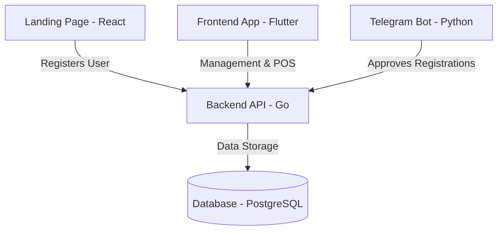
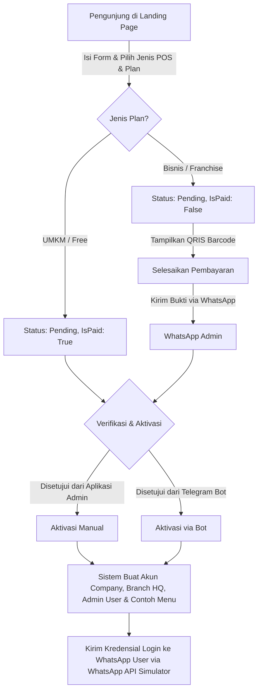
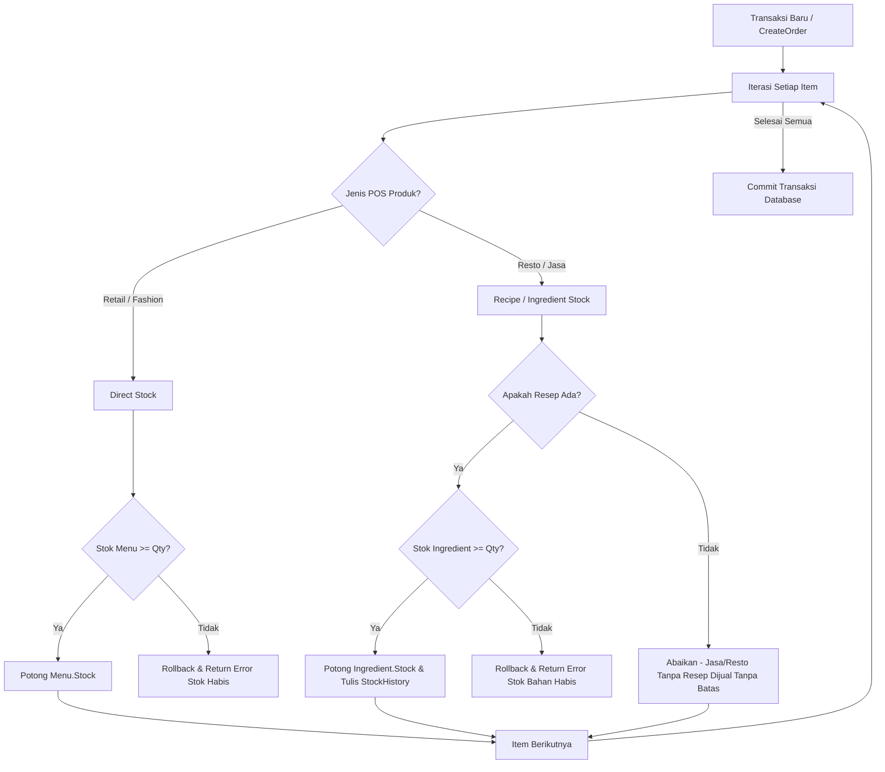
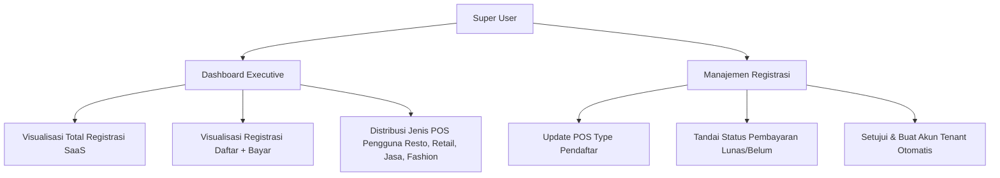
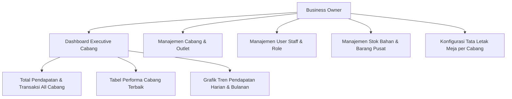
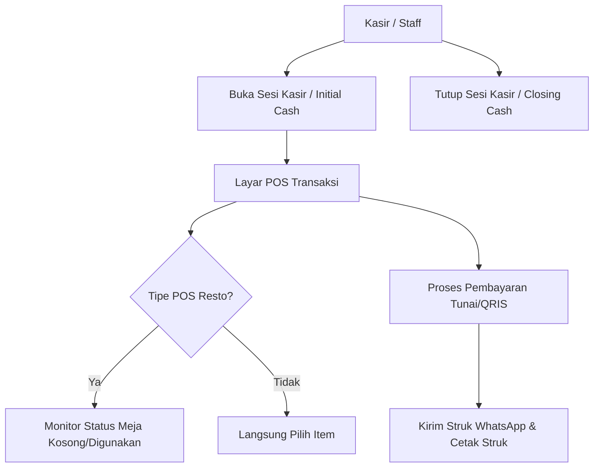

# Dokumentasi Sistem NFM POS (SaaS Multi-Platform)

Dokumentasi ini menjelaskan secara mendetail mengenai Arsitektur Teknologi (Technology Stack), Alur Sistem, Diagram Proses per Role, serta Daftar Endpoint API yang tersedia dalam ekosistem NFM POS.

---

## 1. Arsitektur & Technology Stack

Sistem NFM POS dibangun dengan arsitektur modern berkinerja tinggi, terbagi menjadi 4 komponen utama:

### Detail Komponen Teknologi:
*   **Backend (API Server)**:
    *   **Bahasa/Framework**: Go (Golang) 1.20+ menggunakan framework **Gin Web Framework**.
    *   **ORM**: **GORM** untuk interaksi database relasional secara aman.
    *   **Database**: **PostgreSQL** untuk penyimpanan relasional yang tangguh.
    *   **Keamanan**: JWT (JSON Web Tokens) untuk otentikasi sesi, bcrypt untuk hashing password, dan rate-limiter untuk pencegahan DDoS.
*   **Frontend (Aplikasi POS & Admin)**:
    *   **Bahasa/Framework**: **Flutter** (Dart) mendukung multi-platform (Web, Desktop, Mobile).
    *   **State Management**: **Flutter Riverpod** untuk arsitektur yang bersih, teruji, dan reaktif.
    *   **Network Client**: **Dio** client dengan konfigurasi interceptor JWT.
    *   **Grafik**: **FL Chart** untuk visualisasi grafik laporan penjualan.
*   **Landing Page (Pemasaran & Registrasi)**:
    *   **Bahasa/Framework**: **React.js** dengan bundler **Vite** dan JavaScript ES6.
    *   **Animasi**: **Framer Motion** untuk efek micro-interaction premium.
    *   **Styling**: Vanilla CSS kustom dengan variabel tema dinamis.
*   **Bot Asisten (Telegram & Integrasi AI)**:
    *   **Bahasa/Framework**: **Python** menggunakan **Flask** (untuk proxy webhook) dan **pyTelegramBotAPI** untuk bot polling/callback handler.

---

## 2. Alur Sistem & Proses Bisnis

### A. Alur Registrasi & Pembayaran (SaaS Signup)

### B. Alur Pengurangan Stok POS (Berdasarkan Tipe POS)

Saat kasir melakukan transaksi (`CreateOrder`), sistem memvalidasi dan memotong stok berdasarkan jenis POS dari produk tersebut:

---

## 3. Diagram Proses per Role User

### A. Role: Super User (Owner SaaS NFM Tech)
Super User memiliki kendali penuh atas sistem SaaS, statistik registrasi, dan pendaftaran tenant baru.

### B. Role: Business Owner (Tenant Admin)
Business Owner adalah pemilik bisnis (tenant) yang terdaftar. Memiliki wewenang mengelola cabang, karyawan, inventaris, dan melihat performa finansial seluruh cabang.

### C. Role: Kasir / Staff Cabang
Staff Cabang mengurusi operasional harian seperti membuka sesi kasir, melakukan transaksi penjualan (POS), mencetak struk, dan memantau status meja.

---

## 4. Daftar Endpoint API

Semua request API menggunakan prefix `/api` dan dilindungi oleh `AuthMiddleware` (kecuali public endpoints).

### A. Modul Registrasi & SaaS (Public / Admin)
| Method | Path | Auth | Keterangan |
| :--- | :--- | :--- | :--- |
| **POST** | `/api/registrations` | No | Pendaftaran trial baru dari landing page |
| **GET** | `/api/captcha` | No | Mendapatkan security image captcha |
| **GET** | `/api/registrations` | Yes (Admin) | List seluruh pendaftar trial |
| **PUT** | `/api/registrations/:id` | Yes (Admin) | Update status pendaftaran, status bayar (`is_paid`), atau `pos_type` |
| **POST** | `/api/registrations/:id/approve` | Yes / Token Bot | Menyetujui pendaftaran dan menggenerasikan database tenant |
| **DELETE** | `/api/registrations/:id` | Yes (Admin) | Menghapus data pendaftaran trial |

### B. Modul Dashboard & Statistik
| Method | Path | Auth | Keterangan |
| :--- | :--- | :--- | :--- |
| **GET** | `/api/dashboard/stats` | Yes | Statistik dashboard cabang harian (Kasir) |
| **GET** | `/api/dashboard/executive` | Yes | Statistik executive dashboard multi-cabang (Owner/Super User) |

### C. Modul Otentikasi & Akun
| Method | Path | Auth | Keterangan |
| :--- | :--- | :--- | :--- |
| **POST** | `/api/login` | No | Login user staff / owner |
| **GET** | `/api/auth/me` | Yes | Mengambil data profile user login saat ini |
| **GET** | `/api/profile` | Yes | Mengambil profil detail user saat ini |

### D. Modul Manajemen Meja (Table)
| Method | Path | Auth | Keterangan |
| :--- | :--- | :--- | :--- |
| **GET** | `/api/tables` | Yes | List meja di cabang bersangkutan |
| **POST** | `/api/tables` | Yes | Menambah meja baru |
| **PUT** | `/api/tables/:id` | Yes | Update nomor meja, kapasitas, lantai, atau status |
| **POST** | `/api/tables/:id/image` | Yes | Upload/ganti foto meja |
| **DELETE** | `/api/tables/:id` | Yes | Menghapus meja |

### E. Modul Transaksi & POS (Orders & Payments)
| Method | Path | Auth | Keterangan |
| :--- | :--- | :--- | :--- |
| **GET** | `/api/orders` | Yes | Mengambil list pesanan (bisa difilter status) |
| **GET** | `/api/orders/:id` | Yes | Mengambil detail satu pesanan |
| **POST** | `/api/orders` | Yes | Membuat pesanan baru (Triggers stok checking & deduction) |
| **PUT** | `/api/orders/:id/status` | Yes | Mengupdate status pesanan (Pending -> Siap -> Selesai) |
| **POST** | `/api/orders/:id/pay` | Yes | Memproses transaksi pembayaran |
| **POST** | `/api/orders/:id/void` | Yes | Membatalkan transaksi (Triggers stock reversal) |

### F. Modul Master Data (Menus, Categories, Ingredients, Users, COA)
| Method | Path | Auth | Keterangan |
| :--- | :--- | :--- | :--- |
| **GET/POST/PUT/DELETE** | `/api/menus` | Yes | Manajemen menu produk (resto/retail/fashion/jasa) |
| **GET/POST/PUT/DELETE** | `/api/categories` | Yes | Manajemen kategori produk |
| **GET/POST/PUT/DELETE** | `/api/ingredients` | Yes | Manajemen stok bahan baku (resto/jasa) |
| **GET/POST/PUT/DELETE** | `/api/users` | Yes | Manajemen staff user |
| **GET/POST/PUT/DELETE** | `/api/finance/coa` | Yes | Manajemen Chart of Accounts (Akuntansi) |
